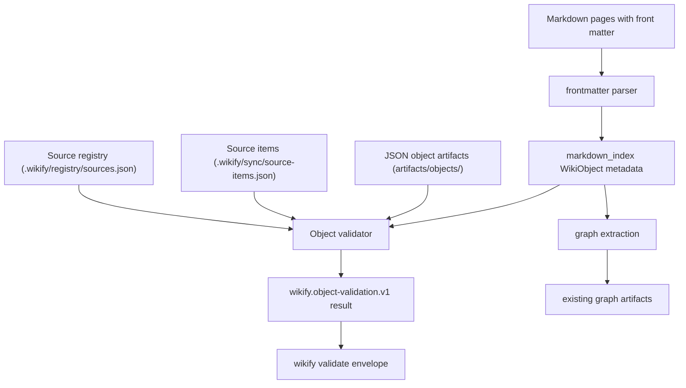

# Phase 24: Research - Wiki Object Model And Validation

**Phase:** 24 - Wiki Object Model And Validation
**Created:** 2026-04-29
**Research mode:** Local codebase research, no external dependencies.

## Executive Summary

Phase 24 should introduce Wikify's canonical object contract without changing the behavior of existing graph, maintenance, sync, or legacy `fokb` flows. The safest architecture is a small stdlib-only object layer with three focused modules:

- `wikify/objects.py` for schema constants, object type vocabulary, deterministic ids, artifact paths, and constructors/adapters.
- `wikify/frontmatter.py` for a constrained Markdown front matter parser/serializer.
- `wikify/object_validation.py` for workspace/path validation and structured validation records.

Existing graph extraction should remain path-id compatible. The only graph-facing change needed in Phase 24 is a metadata bridge: `scan_objects()` reads front matter into `WikiObject.metadata`, exposes `WikiObject.object_id`, and `GraphNode.to_dict()` can include `object_id` while keeping `GraphNode.id == relative_path`.

## Current Code Findings

### Workspace And Source Registry

`wikify/workspace.py` owns the initialized workspace contract:

- Manifest: `wikify.json`, schema `wikify.workspace.v1`.
- Source registry: `.wikify/registry/sources.json`, schema `wikify.source-registry.v1`.
- Workspace paths include `sources`, `wiki`, `artifacts`, `views`, and `.wikify`.
- Errors carry `code` and `details`.
- JSON writes use temp-file plus atomic replace.

Phase 24 should reuse `load_workspace()` and `registry_path()` for source reference validation. It should not create a parallel source registry or redefine source ids.

### Sync And Source Items

`wikify/sync.py` owns source item truth:

- Source item index: `.wikify/sync/source-items.json`, schema `wikify.source-items.v1`.
- Sync report: `.wikify/sync/last-sync.json`, schema `wikify.sync-run.v1`.
- Ingest queue: `.wikify/queues/ingest-items.json`, schema `wikify.ingest-queue.v1`.
- Source item ids are stable `item_<sha256-prefix>` ids.
- Sync is intentionally non-networked and does not generate wiki pages.

Phase 24 should validate source refs against these artifacts when they exist. It should provide adapters from source/source item documents into object-shaped dictionaries, but must not duplicate or fork their durable state.

### Markdown Index And Graph

`wikify/markdown_index.py` currently returns lightweight `WikiObject` records:

- `type` is a legacy folder scope such as `topics`, `parsed`, `briefs`, `sorted`, or `sources`.
- `relative_path` is used as the graph id.
- `title` is derived from the first `# ` heading.
- No front matter is parsed today.

`wikify/graph/extractors.py` builds `GraphNode.id` from `obj.relative_path` and graph edges from Markdown links/wikilinks. This path-id behavior must remain compatible in Phase 24.

The model bridge should therefore be additive:

- Extend `WikiObject` with `metadata: dict`, `object_id: str | None`, and `canonical_type: str`.
- Continue to populate `type` with the existing scope value for compatibility.
- Map legacy scopes to product object types in a new helper, not by changing old folder names.
- Keep graph node ids path-based, but expose `object_id` in node dictionaries when available.

### CLI And Envelopes

`wikify/cli.py` extends the legacy parser and native Wikify commands through `cmd_*` handlers. JSON output uses `wikify/envelope.py`.

Phase 24 should add top-level `wikify validate` with:

- `--path <path>` for focused validation.
- `--strict` for hard enforcement of declared v0.2 object documents.
- JSON envelope output through the existing `print_output()` path.

Recommended exit behavior:

- No hard errors: `ok: true`, `exit_code: 0`, `result.schema_version == "wikify.object-validation.v1"`.
- Hard errors: `ok: false`, `exit_code: 2`, `error.code == "object_validation_failed"`, and `error.details.validation` contains the full `wikify.object-validation.v1` document.

This preserves existing failure envelope semantics while still giving agents the complete validation document.

## Proposed Object Contract

### Schema Versions

The object module should expose exact schema version constants:

- `wikify.object-index.v1`
- `wikify.wiki-page.v1`
- `wikify.topic.v1`
- `wikify.project.v1`
- `wikify.person.v1`
- `wikify.decision.v1`
- `wikify.timeline-entry.v1`
- `wikify.citation.v1`
- `wikify.graph-edge.v1`
- `wikify.context-pack.v1`
- `wikify.object-validation.v1`

Source and source item adapters should reference the existing `wikify.source-registry.v1` and `wikify.source-items.v1` artifacts instead of inventing new source schemas.

### Product Object Types

Canonical object types should be product-level strings:

- `source`
- `source_item`
- `wiki_page`
- `topic`
- `project`
- `person`
- `decision`
- `timeline_entry`
- `citation`
- `graph_edge`
- `context_pack`

Legacy folder scopes can map as follows:

- `topics` -> `topic`
- `timelines` -> `timeline_entry`
- `briefs` -> `wiki_page`
- `parsed` -> `wiki_page`
- `sorted` -> `wiki_page`
- `sources` -> `source`

### Wiki Page Fields

Wiki page objects should require:

- `schema_version`
- `id`
- `type`
- `title`
- `summary`
- `body_path`
- `source_refs`
- `outbound_links`
- `backlinks`
- `created_at`
- `updated_at`
- `confidence`
- `review_status`

`confidence` must be numeric `0.0 <= confidence <= 1.0`. `review_status` must be one of `generated`, `needs_review`, `approved`, `rejected`, or `stale`.

### Markdown Front Matter Subset

Wikify should avoid a YAML dependency. A practical stdlib subset is:

- Front matter begins at byte/text start with `---\n` and ends at the next line containing only `---`.
- Scalar values: strings, integers, floats, booleans, and empty strings.
- Compound values: JSON-flow values on one line, such as `["page_a"]` and `[{"source_id": "src_a"}]`.
- Serializer writes compound values using `json.dumps(..., ensure_ascii=False)`.
- Full YAML features such as anchors, multiline block scalars, tags, and arbitrary nesting are out of scope.

This is readable enough for humans, deterministic for tests, and compatible with YAML parsers because JSON flow style is valid YAML syntax.

## Validation Design

Validation should scan two families:

1. JSON artifacts under `artifacts/objects/`.
2. Markdown files in the existing scanned wiki scopes or under a focused `--path`.

Default mode must tolerate legacy Markdown. A Markdown file with no declared `schema_version` can produce warnings but should not fail the sample KB. A declared v0.2 object document must be checked more strictly.

Strict mode should fail when:

- Required fields are missing.
- Object ids duplicate.
- Object links/backlinks/graph edge endpoints reference unknown object ids.
- `source_refs` contain unresolved `source_id` or `item_id` values when registry/source-item artifacts exist.
- Declared object documents contain invalid schema/version/type/confidence/review status values.
- Front matter is malformed.

Validation records should include exactly these stable fields:

- `code`
- `message`
- `path`
- `object_id`
- `field`
- `severity`
- `details`

Important codes:

- `object_required_field_missing`
- `object_duplicate_id`
- `object_link_unresolved`
- `object_source_ref_unresolved`
- `object_frontmatter_invalid`
- `object_schema_invalid`

Additional warning codes are acceptable for compatibility cases, but the six codes above must exist in tests and docs.

## Data Flow

## Risks And Mitigations

| Risk | Mitigation |
|------|------------|
| Breaking `wikify graph` path ids | Keep `GraphNode.id` as `relative_path`; add `object_id` only as metadata. |
| Overbuilding schema runtime | Use dictionaries, constants, and explicit stdlib validation instead of Pydantic/JSON Schema. |
| Treating legacy sample KB as invalid | Default mode warns for missing v0.2 metadata; strict mode enforces declared v0.2 objects. |
| Front matter parser becomes a partial YAML clone | Support only documented scalars and JSON-flow compound values. |
| Source/source item truth forks | Validate against Phase 22/23 artifacts and expose adapters only. |
| Validator mutates user content | Phase 24 validation is read-only except optional validation report artifact writes. |

## Recommended Implementation Order

1. Add failing tests for object constants, constructors, adapters, and artifact paths.
2. Implement `wikify/objects.py`.
3. Add failing tests for front matter parser and Markdown metadata scanning.
4. Implement `wikify/frontmatter.py` and additive `markdown_index` metadata fields.
5. Add failing tests for validator behavior and validation result shape.
6. Implement `wikify/object_validation.py`.
7. Add graph compatibility tests and implement object id metadata bridge.
8. Add CLI validate tests and wire `wikify validate`.
9. Update docs and protocol.
10. Run focused/full verification and update GSD summary artifacts.

