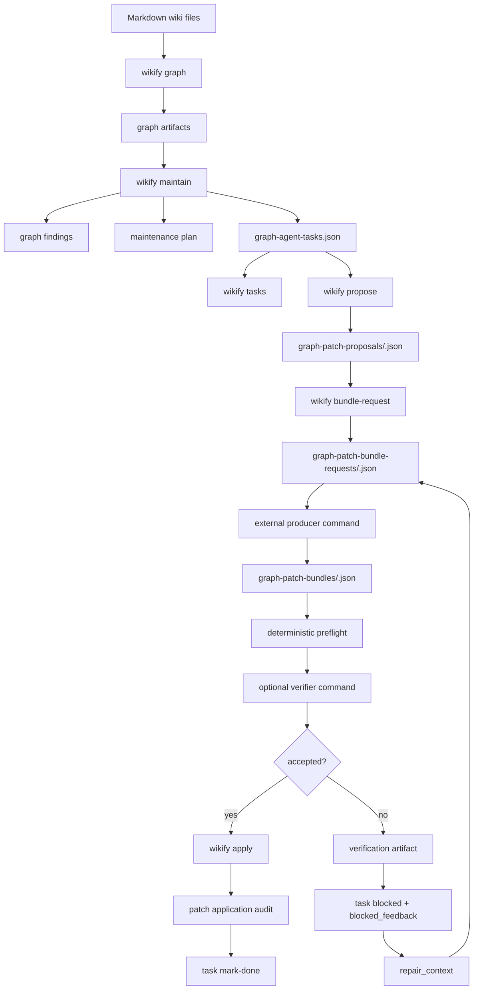

# Wikify v0.1.0a2 功能性报告

**版本:** `v0.1.0a2 Agentic Maintenance Automation`
**报告日期:** 2026-04-29
**代码状态:** 本地 tag `v0.1.0a2`
**报告范围:** 已完成的 GSD 里程碑 1-21，以及对应 CLI、维护模块、图谱模块、审计和测试证据。

## 1. 结论摘要

Wikify v0.1.0a2 已经从一个 Markdown 知识库 CLI，演进成一个面向 agent 的、低打扰的、可审计的本地知识库维护系统。它的核心不是“内置偷偷调用 LLM 自动改正文”，而是把知识库维护拆成一组明确、可检查、可回滚的 artifact 和命令：

- `wikify graph` 生成知识图谱。
- `wikify maintain` 发现维护问题，并写入 agent 可消费的任务队列。
- `wikify tasks` 读取和推进任务生命周期。
- `wikify propose` 生成受 write scope 限制的补丁提案。
- `wikify bundle-request` 把任务和目标文件快照打包成外部 agent 请求。
- `wikify produce-bundle` 通过显式外部命令生成 patch bundle。
- `wikify verify-bundle` 通过显式 verifier agent 审核 patch bundle。
- `wikify apply` 只执行确定性的文本替换，并写入审计记录。
- `wikify rollback` 基于 hash 守卫回滚已应用补丁。
- `wikify run-task` 串起单任务自动化。
- `wikify run-tasks` 串起有界批量自动化。
- `wikify maintain-run` 串起维护刷新和批量执行。
- `wikify maintain-loop` 做多轮有界维护。
- `wikify agent-profile` 保存显式外部命令 profile，减少重复输入。

当前系统已经具备一条完整闭环：

```text
graph findings -> agent tasks -> proposal -> bundle request -> external producer
-> deterministic preflight -> optional verifier -> apply -> lifecycle done
```

当 verifier 拒绝补丁时，系统不会让错误停留在瞬时 stderr；它会把任务标记为 `blocked`，写入 `blocked_feedback` 和 lifecycle event，再把反馈作为 `repair_context` 送回后续 producer run。也就是说，自动化不只是“能跑”，还知道如何在安全失败后继续修。

里程碑审计结论为 `passed`：

- 133/133 个当前里程碑需求满足。
- 21/21 个 phase summary 存在。
- 21/21 个 phase verification artifact 存在。
- 全量测试通过：240 tests。
- `python3 -m compileall -q wikify` 通过。
- `git diff --check` 通过。

## 2. 产品定位

Wikify 的定位是“agent-facing Markdown knowledge base control CLI”。它不是一个传统 GUI 笔记工具，也不是一个内置 provider 的 LLM app。它的设计重点是让 agent 可以稳定地维护本地 Markdown wiki，同时保留人类可读的 Markdown 源文件和机器可读的 JSON artifact。

### 2.1 面向的使用者

主要使用者有三类：

| 使用者 | 需要什么 | Wikify 提供什么 |
|--------|----------|-----------------|
| 人类知识库维护者 | 本地 Markdown 可控、可审计、可回滚 | 所有正文仍是 Markdown；自动化产生 artifact；变更有审计记录 |
| 编码/知识维护 agent | 稳定命令、JSON 输入输出、低打扰流程 | CLI envelope、任务队列、bundle request、profile、loop |
| verifier/reviewer agent | 可审核上下文、明确 verdict schema | `verify-bundle` request + `wikify.patch-bundle-verdict.v1` |

### 2.2 与 Graphify/llm_wiki 思路的融合点

本里程碑融合了两个方向：

- Graphify 方向：结构化图谱、节点关系、图相关性、维护发现、任务优先级。
- llm_wiki 方向：Markdown-first 知识库、面向 LLM/agent 的知识整理流程、低摩擦维护体验。

融合后的 Wikify 不是复制 UI 或 GPL 实现，而是把“Markdown 知识库 + 图结构洞察 + agent 自动维护”变成 CLI-first 的 artifact pipeline。

## 3. 功能地图

### 3.1 知识库基础能力

Wikify 继承并保留了旧 `fokb` 能力，`wikify` 是新的主 CLI 名称，`fokb` 保持兼容 alias。已有基础能力包括：

- 初始化/发现知识库根目录。
- ingest、query、search、show、list、stats 等知识库操作。
- topic、source、parsed、sorted 等 Markdown 对象扫描。
- legacy maintenance/history 支持。
- 输出 envelope 支持 json、pretty、quiet 等模式。

本报告重点覆盖 v0.1.0a2 新增和稳定化的 agentic maintenance automation。

### 3.2 图谱能力

`wikify graph` 负责编译 Markdown wiki 对象为图谱 artifact。

核心功能：

- 从 topics、timelines、briefs、parsed、sorted、sources 等范围扫描对象。
- 提取节点和边。
- 识别 Markdown link 和 wikilink。
- 写入图 JSON、图报告和可选 HTML。
- 支持 `--scope` 限定构建范围。
- 支持 `--no-html` 跳过 HTML 输出。

关键输出：

| Artifact | 用途 |
|----------|------|
| `sorted/graph.json` 或等价图谱输出 | 机器可读图结构 |
| graph report | 人类可读图谱概览 |
| graph HTML | 可视化查看图关系 |

相关模块：

- `wikify/graph/builder.py`
- `wikify/graph/extractors.py`
- `wikify/graph/model.py`
- `wikify/graph/relevance.py`
- `wikify/graph/analytics.py`
- `wikify/graph/report.py`
- `wikify/graph/html.py`

### 3.3 维护发现能力

`wikify maintain` 负责从图谱分析出维护 findings，并形成计划、执行分类、历史和 agent task queue。

核心功能：

- 刷新 graph artifact。
- 生成 graph findings。
- 生成 maintenance plan。
- 对 plan step 做执行分类：可确定性执行的动作与需要 agent 判断的动作分开。
- 写入 maintenance history。
- 写入 `sorted/graph-agent-tasks.json`。
- `--dry-run` 预览 task queue 但不写 task queue artifact。
- 不编辑内容页面，不调用隐藏 LLM。

任务条目包括：

- finding id
- action
- priority
- target
- evidence
- write scope
- instructions
- acceptance checks
- status
- requires_user

### 3.4 Agent task 读取与生命周期

`wikify tasks` 是 agent 读取任务和推进状态的稳定入口。

读取能力：

- `--status`
- `--action`
- `--id`
- `--limit`
- `--refresh`
- `--policy`

生命周期动作：

- `--mark-proposed`
- `--start`
- `--mark-done`
- `--mark-failed`
- `--block`
- `--cancel`
- `--retry`
- `--restore`
- `--note`
- `--proposal-path`

状态机支持：

```text
queued -> proposed -> in_progress -> done
queued/proposed/in_progress -> failed
queued/proposed/in_progress -> blocked
queued/proposed/in_progress -> rejected
failed/blocked/rejected -> queued via retry/restore
```

生命周期规则：

- 默认 `tasks` 读取是只读。
- 只有显式 lifecycle flag 才会改状态。
- 每次状态变化写入 append-only event artifact。
- invalid transition 返回 structured error。
- retry/restore 会清理过期 verifier rejection feedback。

关键 artifact：

| Artifact | 用途 |
|----------|------|
| `sorted/graph-agent-tasks.json` | 当前 task queue |
| `sorted/graph-agent-task-events.json` | 生命周期事件日志 |

### 3.5 Scoped patch proposal

`wikify propose --task-id <id>` 根据单个 task 生成补丁提案。

核心功能：

- 读取 task queue 中一个 task。
- 校验 write scope。
- 生成 `wikify.patch-proposal.v1`。
- 写入 `sorted/graph-patch-proposals/<task-id>.json`。
- `--dry-run` 返回 proposal 但不写文件。
- 不改正文、不改 lifecycle。

proposal 价值：

- 把“应该做什么”变成可审查 artifact。
- 后续 apply 不重新推断意图，只消费 proposal。
- agent 可以先看 proposal 再决定是否生成 patch bundle。

proposal 内容包括：

- task evidence
- write scope
- planned edits
- acceptance checks
- risk level
- purpose context
- preflight summary

### 3.6 Purpose-aware proposals

Wikify 支持可选目的文件：

- `purpose.md`
- `wikify-purpose.md`

作用：

- 提供 wiki 的目标、受众、风格或长期方向。
- enrich proposal rationale。
- 不扩大 write scope。
- 不降低路径安全约束。
- 缺失时非阻塞，proposal metadata 会记录 `present = false`。

### 3.7 Graph relevance scoring

Wikify 对 graph findings 和 tasks 增加可解释 relevance signals。

信号包括：

- direct links
- source overlap
- common neighbors
- type affinity

使用方式：

- 影响 priority 和 explanation。
- 低置信度结果只做 informational。
- 不直接触发自动写入。

这使 task 排序更像“图结构中的有意义维护”，而不是机械列队。

### 3.8 Patch bundle request

`wikify bundle-request --task-id <id>` 把 proposal、task、目标文件快照和 allowed patch schema 打包给外部 agent。

核心功能：

- 创建或复用 proposal context。
- 读取目标文件内容和 hash。
- 写入 `sorted/graph-patch-bundle-requests/<task-id>.json`。
- `--dry-run` 不写文件。
- 不改正文、不改 lifecycle。

request 包含：

- task evidence
- proposal evidence
- write scope
- target file snapshots
- content hashes
- allowed operation contract
- suggested bundle path
- repair context, 如果这是 verifier-blocked repair run

这个 artifact 是外部 agent 生成 patch bundle 的主要上下文。

### 3.9 External patch bundle producer

`wikify produce-bundle --request-path <path> --agent-command <command>` 显式调用外部命令生成 patch bundle。

核心功能：

- request JSON 通过 stdin 传给外部 command。
- request path 和 bundle path 通过 env 暴露。
- 外部 command 可以 stdout 输出 bundle JSON。
- 外部 command 也可以自己写入 suggested bundle path。
- 生成后立即走 deterministic preflight。
- `--dry-run` 不执行外部 command。
- command failure、timeout、invalid output、preflight failure 都返回 structured error。

重要边界：

- Wikify 不内置 provider。
- 不读取 API key。
- 不选择模型。
- 不做隐藏 retry。
- provider/key/model/retry 由外部 command 自己管理。

### 3.10 Patch apply and rollback

`wikify apply` 是唯一确定性正文 mutation 入口。

核心规则：

- 必须同时提供 proposal path 和 bundle path。
- bundle schema 必须是 `wikify.patch-bundle.v1`。
- 当前支持 deterministic `replace_text`。
- operation path 必须在 proposal write scope 内。
- source text 必须在目标文件中 exact-once match。
- `--dry-run` 只做 preflight，不写正文、不写 audit record。
- 非 dry-run 写正文，并写 application audit record。

`wikify rollback` 根据 application audit record 回滚。

rollback 规则：

- 只在当前内容 hash 等于 post-apply hash 时回滚。
- 若文件已经被其他过程改动，拒绝回滚，避免覆盖新变更。

关键 artifact：

| Artifact | 用途 |
|----------|------|
| `wikify.patch-application-preflight.v1` | apply 前验证结果 |
| `wikify.patch-application.v1` | 成功 apply 的审计记录 |
| `wikify.patch-rollback.v1` | rollback 结果 |

### 3.11 Single task runner

`wikify run-task --id <id>` 串起单个 task 的自动化。

无外部 producer 时：

1. 读取 task。
2. 创建或复用 proposal。
3. 缺 bundle 时写 bundle request。
4. 返回 `waiting_for_patch_bundle`。
5. 不编辑正文。

有外部 producer 时：

1. 读取 task。
2. 创建或复用 proposal。
3. 写 bundle request。
4. 调用显式 producer command/profile。
5. preflight bundle。
6. 可选 verifier command/profile。
7. apply。
8. mark done。

关键参数：

- `--id`
- `--bundle-path`
- `--agent-command`
- `--agent-profile`
- `--verifier-command`
- `--verifier-profile`
- `--producer-timeout`
- `--verifier-timeout`
- `--dry-run`

### 3.12 Batch task runner

`wikify run-tasks` 对多个 task 做有界顺序执行。

默认：

- `status=queued`
- `limit=5`
- sequential
- stop on first failure

可选：

- `--status`
- `--action`
- `--id`
- `--limit`
- `--agent-command`
- `--agent-profile`
- `--verifier-command`
- `--verifier-profile`
- `--continue-on-error`
- `--dry-run`

输出：

- `wikify.agent-task-batch-run.v1`
- selection
- per-task result
- success/waiting/failure counts
- next actions

### 3.13 Maintain-run

`wikify maintain-run` 是单命令维护自动化入口。

流程：

```text
maintain refresh -> fresh task selection -> run-tasks batch
```

默认：

- policy `balanced`
- status `queued`
- limit `5`
- sequential
- stop on first failure

重要行为：

- dry-run 使用 fresh in-memory queue 做预览。
- dry-run 不执行 producer/verifier。
- dry-run 不写 lifecycle events。
- dry-run 不 apply。
- 非 dry-run 组合 existing primitives，不新增 mutation 语义。

### 3.14 Maintain-loop

`wikify maintain-loop` 是多轮低打扰维护入口。

默认：

- `--max-rounds 3`
- `--task-budget 15`
- 每轮 `--limit 5`
- status `queued`
- policy `balanced`
- sequential
- stop-on-error

stop reasons：

- `no_tasks`
- `waiting_for_patch_bundle`
- `failed_tasks`
- `task_budget_exhausted`
- `max_rounds_reached`
- `dry_run_preview`

dry-run 特性：

- 只预览一轮。
- 因为 dry-run 不写 task queue 或 lifecycle，重复 dry-run 会不断看到同一组 in-memory selection。

### 3.15 Agent profiles

`wikify agent-profile` 管理显式外部命令 profile。

操作：

- `--set <name> --agent-command <command>`
- `--list`
- `--show <name>`
- `--unset <name>`
- `--set-default <name>`
- `--show-default`
- `--clear-default`
- `--producer-timeout`
- `--description`

artifact：

```text
wikify-agent-profiles.json
```

schema：

```text
wikify.agent-profiles.v1
```

安全边界：

- profile 是 command alias，不是 provider adapter。
- profile 不存 API key。
- default profile 只在显式传入裸 `--agent-profile` 或裸 `--verifier-profile` 时生效。
- 仅仅配置 default profile 不会自动执行外部 command。
- 同时传 `--agent-command` 和 `--agent-profile` 返回 ambiguity error。

### 3.16 Verifier gate

`wikify verify-bundle` 让显式 verifier agent 在 apply 前审核 bundle。

流程：

1. 读取 proposal。
2. 读取 patch bundle。
3. 运行 deterministic preflight。
4. 构造 `wikify.patch-bundle-verification-request.v1`。
5. verifier command 从 stdin 读取 request。
6. verifier 输出 `wikify.patch-bundle-verdict.v1`。
7. Wikify 写 `sorted/graph-patch-verifications/<task-id>.json`。

verdict 关键字段：

- `accepted: true/false`
- summary
- findings

accepted：

- 允许后续 apply。

rejected：

- 写 verification artifact。
- 阻止 apply。
- 在 `run-task` 自动化中会 block task。
- content 不变。
- application record 不写。

### 3.17 Verifier rejection feedback

在 `run-task` 中 verifier rejection 会转换成 durable task feedback。

写入位置：

- task `status = blocked`
- task `blocked_feedback`
- lifecycle event `details`
- error details 中的 `agent_tasks`
- error details 中的 `task_events`
- verification path

反馈内容：

- verdict
- summary
- findings
- verification artifact path
- repair instructions

价值：

- 后续 agent 不需要问用户“为什么失败”。
- batch/loop 可以选择 blocked tasks 做 repair。
- audit trail 保留完整失败原因。

### 3.18 Verifier repair automation

`run-task` 可以修复 verifier-blocked task。

触发方式：

```bash
wikify run-task --id <id> --agent-command "..." --verifier-command "..."
```

或者：

```bash
wikify run-tasks --status blocked --agent-profile default --verifier-profile reviewer
```

核心行为：

- 识别 task 是否因为 bundle verifier 拒绝而 blocked。
- retry blocked task。
- 若 task 已经手动 retry，也能从 latest block event 取 feedback。
- request 中加入 `repair_context`。
- 强制 producer 重新生成默认 bundle，不复用旧 rejected bundle。
- 再次 verifier。
- accepted 后才 apply 和 mark done。
- rejected repair 仍然不改正文、不写 application record，并刷新 blocked feedback。

## 4. 命令总览

| 命令 | 类型 | 是否可能改正文 | 是否可能外部执行 | 主要用途 |
|------|------|----------------|------------------|----------|
| `graph` | 读/写 artifact | 否 | 否 | 生成图谱 artifact |
| `maintain` | 读/写 artifact | 否 | 否 | 发现维护问题，生成 task queue |
| `tasks` | 读/生命周期 | 否 | 否 | 读取 task、推进状态 |
| `propose` | proposal | 否 | 否 | 生成 scoped proposal |
| `bundle-request` | request | 否 | 否 | 给外部 agent 准备 bundle request |
| `produce-bundle` | 外部 producer | 否 | 是，显式 flag | 生成 patch bundle |
| `verify-bundle` | 外部 verifier | 否 | 是，显式 flag | 审核 bundle |
| `apply` | mutation | 是 | 否 | 确定性应用 patch bundle |
| `rollback` | mutation | 是 | 否 | hash-guarded rollback |
| `run-task` | orchestration | 可能 | 是，显式 flag | 单 task 自动化 |
| `run-tasks` | orchestration | 可能 | 是，显式 flag | 有界批量自动化 |
| `maintain-run` | orchestration | 可能 | 是，显式 flag | refresh + batch |
| `maintain-loop` | orchestration | 可能 | 是，显式 flag | 多轮有界维护 |
| `agent-profile` | config | 否 | 否 | 管理外部 command profile |

## 5. 数据和 artifact 流动

### 5.1 主流程



### 5.2 Artifact 目录约定

| 路径 | 写入方 | 作用 |
|------|--------|------|
| `sorted/graph-agent-tasks.json` | `maintain` | agent 任务队列 |
| `sorted/graph-agent-task-events.json` | `tasks` / runner | lifecycle 事件 |
| `sorted/graph-patch-proposals/<task-id>.json` | `propose` / runner | 补丁提案 |
| `sorted/graph-patch-bundle-requests/<task-id>.json` | `bundle-request` / runner | 外部 producer 请求 |
| `sorted/graph-patch-bundles/<task-id>.json` | external producer / `produce-bundle` | patch bundle |
| `sorted/graph-patch-verifications/<task-id>.json` | `verify-bundle` / runner | verifier 审核记录 |
| application audit record | `apply` | 正文变更审计和 rollback 证据 |
| `wikify-agent-profiles.json` | `agent-profile` | 外部 command profile |

### 5.3 JSON schema surface

| Schema | 用途 |
|--------|------|
| `wikify.graph.v1` | 图谱 artifact |
| `wikify.graph-relevance.v1` | relevance signals |
| `wikify.graph-findings.v1` | graph findings |
| `wikify.maintenance-plan.v1` | maintenance plan |
| `wikify.graph-agent-tasks.v1` | task queue |
| `wikify.agent-task-selection.v1` | task selection |
| `wikify.agent-task-lifecycle.v1` | lifecycle command result |
| `wikify.graph-agent-task-events.v1` | lifecycle event log |
| `wikify.patch-proposal.v1` | patch proposal |
| `wikify.patch-bundle-request.v1` | producer request |
| `wikify.patch-bundle.v1` | external patch bundle |
| `wikify.patch-bundle-production.v1` | producer result |
| `wikify.patch-application-preflight.v1` | apply preflight |
| `wikify.patch-application.v1` | apply audit record |
| `wikify.patch-rollback.v1` | rollback result |
| `wikify.agent-task-run.v1` | single task runner |
| `wikify.agent-task-batch-run.v1` | batch runner |
| `wikify.maintenance-run.v1` | maintain-run |
| `wikify.maintenance-loop.v1` | maintain-loop |
| `wikify.agent-profiles.v1` | profile config |
| `wikify.patch-bundle-verification-request.v1` | verifier request |
| `wikify.patch-bundle-verdict.v1` | verifier verdict |
| `wikify.patch-bundle-verification.v1` | verification result |

## 6. 自动化等级

Wikify 当前可以按四种强度使用。

### 6.1 手动审查模式

适合刚开始接入或高风险知识库：

```bash
wikify maintain
wikify tasks
wikify propose --task-id agent-task-1
wikify bundle-request --task-id agent-task-1
```

人类或 agent 手动阅读 proposal/request 后再决定下一步。

### 6.2 外部 agent 生产模式

适合将 Codex/Claude/本地脚本作为 producer：

```bash
wikify produce-bundle --request-path sorted/graph-patch-bundle-requests/agent-task-1.json --agent-command "python3 agent.py"
wikify apply --proposal-path sorted/graph-patch-proposals/agent-task-1.json --bundle-path sorted/graph-patch-bundles/agent-task-1.json
```

### 6.3 单任务自动化模式

适合明确指定一个 task：

```bash
wikify run-task --id agent-task-1 --agent-command "python3 agent.py" --verifier-command "python3 verifier.py"
```

### 6.4 低打扰循环模式

适合日常维护：

```bash
wikify agent-profile --set default --agent-command "python3 agent.py"
wikify agent-profile --set reviewer --agent-command "python3 verifier.py"
wikify maintain-loop --max-rounds 3 --task-budget 15 --limit 5 --agent-profile default --verifier-profile reviewer
```

## 7. 安全模型

### 7.1 明确不做的事

Wikify 当前明确不做：

- 不隐藏调用 LLM。
- 不隐藏读取 API key。
- 不选择 provider。
- 不选择 model。
- 不做隐藏 retry。
- 不让 `maintain` 直接编辑正文。
- 不让 `propose` 直接编辑正文。
- 不让 `bundle-request` 直接编辑正文。
- 不让 `produce-bundle` 直接编辑正文。
- 不让 `verify-bundle` 直接编辑正文。
- 不让 default profile 自动触发外部执行。

### 7.2 允许改正文的入口

正文 mutation 只通过：

- `wikify apply`
- `wikify rollback`
- 组合命令中的 apply/rollback primitive

组合命令不会绕过 apply 的规则。

### 7.3 Patch 安全规则

- proposal 约束 write scope。
- bundle operation path 必须在 write scope 内。
- 仅支持 deterministic replacement。
- source text 必须 exact-once。
- apply 写审计。
- rollback 要 hash guard。
- verifier rejection 在 apply 之前阻断。

### 7.4 外部 agent 安全边界

外部 producer/verifier 都必须通过显式 flag 或 profile 触发：

- `--agent-command`
- `--agent-profile`
- `--verifier-command`
- `--verifier-profile`

profile 只是命令别名，不是 provider 配置中心。

## 8. 错误和失败处理

### 8.1 常见等待态

`waiting_for_patch_bundle`：

- proposal 已准备。
- bundle request 已准备。
- 没有 patch bundle。
- 没有外部 producer command。
- 系统停下等待 agent 生成 bundle。

### 8.2 Producer 失败

失败来源：

- command exit non-zero
- timeout
- stdout 不是有效 JSON
- bundle schema 不对
- preflight 不通过

行为：

- structured error
- 不写正文
- 保留已生成的 proposal/request 供排查

### 8.3 Verifier 拒绝

行为：

- 写 verification artifact。
- 返回 `patch_bundle_verification_rejected`。
- `run-task` 中标记 task blocked。
- 写 blocked feedback。
- 不 apply。
- 不写 application record。

### 8.4 Repair 再失败

行为：

- content unchanged。
- application record 不写。
- fresh rejection feedback 持久化。
- 后续可以继续 repair。

### 8.5 Rollback 失败

主要原因：

- 当前文件内容已不是 apply 后 hash。
- 说明有其他变更发生。
- rollback 拒绝覆盖，避免破坏后续修改。

## 9. 典型使用场景

### 9.1 只查看知识库图结构

```bash
wikify graph --scope all --no-html
```

适合：

- 想看知识库对象是否能被扫描。
- 想检查 wikilink 或 graph report。
- 不准备自动维护。

### 9.2 查看当前维护任务

```bash
wikify maintain
wikify tasks --status queued --limit 10
```

适合：

- 初次查看维护队列。
- 人类或 agent 评估任务优先级。

### 9.3 安全生成补丁提案

```bash
wikify propose --task-id agent-task-1
```

适合：

- 想先看写入范围和建议。
- 不想直接生成正文 patch。

### 9.4 外部 agent 生成 patch bundle

```bash
wikify bundle-request --task-id agent-task-1
wikify produce-bundle --request-path sorted/graph-patch-bundle-requests/agent-task-1.json --agent-command "python3 agent.py"
```

适合：

- 用 Codex/Claude/脚本生成具体 patch bundle。
- 仍然让 Wikify 控制 preflight。

### 9.5 verifier 审核后应用

```bash
wikify run-task --id agent-task-1 --agent-profile default --verifier-profile reviewer
```

适合：

- 生产风格自动化。
- agent 负责写，另一个 agent 负责审。

### 9.6 修复被 verifier 拒绝的任务

```bash
wikify run-tasks --status blocked --limit 5 --agent-profile default --verifier-profile reviewer
```

适合：

- 自动处理被 block 的修复任务。
- 利用 `repair_context` 反馈重新生成 bundle。

### 9.7 日常低打扰维护

```bash
wikify maintain-loop --max-rounds 3 --task-budget 15 --limit 5 --agent-profile default --verifier-profile reviewer
```

适合：

- 周期性清理 broken links、整理图结构、补充关系。
- 希望系统自动跑到明确 stop condition。

## 10. 模块视角

| 模块 | 负责功能 |
|------|----------|
| `wikify/graph/builder.py` | graph artifact 构建 |
| `wikify/graph/extractors.py` | Markdown 对象到 graph node/edge 的提取 |
| `wikify/graph/relevance.py` | relevance scoring |
| `wikify/maintenance/runner.py` | maintain 主流程 |
| `wikify/maintenance/findings.py` | graph findings |
| `wikify/maintenance/planner.py` | maintenance plan |
| `wikify/maintenance/executor.py` | maintenance plan deterministic execution/queue 分类 |
| `wikify/maintenance/task_queue.py` | agent task queue |
| `wikify/maintenance/task_reader.py` | task selection/read API |
| `wikify/maintenance/task_lifecycle.py` | task 状态机和 event log |
| `wikify/maintenance/proposal.py` | scoped patch proposal |
| `wikify/maintenance/purpose.py` | purpose context |
| `wikify/maintenance/bundle_request.py` | producer request |
| `wikify/maintenance/bundle_producer.py` | explicit external producer adapter |
| `wikify/maintenance/bundle_verifier.py` | explicit verifier adapter |
| `wikify/maintenance/patch_apply.py` | apply/preflight/rollback |
| `wikify/maintenance/task_runner.py` | single task orchestration |
| `wikify/maintenance/batch_runner.py` | batch orchestration |
| `wikify/maintenance/maintain_run.py` | maintain + batch orchestration |
| `wikify/maintenance/maintain_loop.py` | bounded multi-round orchestration |
| `wikify/maintenance/agent_profile.py` | external command profiles |

## 11. 需求覆盖

当前 archive 记录 133 个当前里程碑需求全部完成。

覆盖范围：

- Graph maintenance: GMT-01 到 GMT-05
- Documentation: DOC-01 到 DOC-02
- Task reading: TSK-01 到 TSK-05
- Proposal: PRP-01 到 PRP-06
- Lifecycle: LIF-01 到 LIF-05
- Relevance: REL-01 到 REL-04
- Purpose: PUR-01 到 PUR-04
- Apply/Rollback: APP-01 到 APP-06
- Task runner: RUN-01 到 RUN-07
- Bundle request/handoff: BND-01 到 BND-06, HND-01 到 HND-05
- Producer: EBP-01 到 EBP-07
- Run-task producer automation: RTP-01 到 RTP-07
- Batch: BTA-01 到 BTA-08
- Maintain-run: MRA-01 到 MRA-07
- Agent profile: AGP-01 到 AGP-08
- Default profile: DFP-01 到 DFP-07
- Maintain-loop: MLP-01 到 MLP-08
- Verifier gate: VFG-01 到 VFG-08
- Rejection feedback: VRF-01 到 VRF-07
- Repair automation: RPR-01 到 RPR-07
- Milestone verification closure: GSV-01 到 GSV-04

## 12. 验收和质量证据

最新验收：

```bash
python3 -m unittest discover -s tests -v
python3 -m compileall -q wikify
git diff --check
```

结果：

- 240 tests passed。
- compileall passed。
- diff whitespace check passed。
- 21 个 phase verification artifact 存在。
- milestone audit `status: passed`。

测试覆盖的代表性领域：

- graph builder/extractors/relevance
- maintenance runner/findings/planner
- task queue/task reader/lifecycle
- proposal/purpose
- patch apply/rollback
- bundle request/producer/verifier
- task runner/batch runner
- maintain-run/maintain-loop
- agent profile/default profile
- CLI parser and CLI integration behavior

## 13. 当前限制

### 13.1 Provider-backed agent consumer 尚未内置

当前系统支持显式外部 command，但没有内置 OpenAI/Anthropic/其他 provider SDK。

原因：

- provider 配置、key 管理、模型选择、retry 策略需要单独设计。
- 不能在 CLI 内隐藏这些语义。

### 13.2 Patch operation 仍较保守

当前支持 deterministic text replacement。尚未支持更丰富的 multi-operation patch bundle。

原因：

- 多 operation 需要 sequential hash semantics。
- 否则 rollback 和 apply order 容易不安全。

### 13.3 UI 不在当前范围

当前是 CLI-first agent surface，不做 Desktop/Tauri UI parity。

原因：

- 用户当前核心诉求是自动化和低打扰。
- UI 会引入新的产品面和状态管理成本。

### 13.4 GSD 工具链局部手动维护

本里程碑中 `gsd-sdk` 不在 PATH，因此 GSD 文件由 Codex 手动维护。

影响：

- 能完成，但长远效率不如真正 SDK workflow。
- 以后应恢复 SDK 或添加轻量本地 helper。

## 14. 风险评估

| 风险 | 当前状态 | 缓解 |
|------|----------|------|
| agent 生成错误 patch | 已控制 | write scope、preflight、verifier、apply exact-once |
| 自动化过度修改正文 | 已控制 | 只有 apply/rollback 能 mutation；maintain/propose/request 不改正文 |
| provider 行为不透明 | 已控制 | 外部 command/profile 显式触发 |
| verifier 拒绝后卡死 | 已改善 | blocked_feedback + repair_context |
| rollback 覆盖后续编辑 | 已控制 | post-apply hash guard |
| batch/loop blast radius | 已控制 | limit、task budget、max rounds、sequential、stop-on-error |
| GSD artifact 不完整 | 已关闭 | Phase 21 生成 21 个 verification 文件 |

## 15. 运营建议

### 15.1 默认推荐流程

开发/本地实验：

```bash
wikify maintain-run --dry-run
wikify maintain-run --limit 2 --agent-profile default --verifier-profile reviewer
```

稳定维护：

```bash
wikify maintain-loop --max-rounds 3 --task-budget 15 --limit 5 --agent-profile default --verifier-profile reviewer
```

风险较高知识库：

```bash
wikify maintain
wikify tasks
wikify propose --task-id <id>
wikify bundle-request --task-id <id>
```

### 15.2 profile 管理建议

建议至少配置两个 profile：

- `default`: producer agent
- `reviewer`: verifier agent

不要把 API key 写入 `wikify-agent-profiles.json`。外部 command 应从自己的环境变量或安全配置读取密钥。

### 15.3 监控建议

每次维护后看：

- task queue 剩余数量
- blocked tasks
- verification artifacts
- application audit records
- rollback 是否需要
- maintain-loop stop_reason

## 16. 下一里程碑建议

建议下一里程碑不要直接“继续堆功能”，而是在以下三个方向里选一个作为主线：

### 16.1 Provider-backed semantic generation

目标：

- 在保留显式边界的前提下，设计 OpenAI/Anthropic 等 provider adapter。

必须先设计：

- key 来源
- model 配置
- retry 策略
- cost/timeout
- redaction
- audit record
- provider failure semantics

### 16.2 Release packaging and adoption

目标：

- 让外部用户更容易安装和使用 Wikify。

可能包含：

- CLI packaging
- example wiki
- sample producer/verifier scripts
- release notes
- quickstart
- compatibility matrix

### 16.3 Hardening and developer ergonomics

目标：

- 降低长期维护成本。

可能包含：

- 恢复或替代 `gsd-sdk`
- schema docs 自动生成
- fixture-based smoke tests
- report generator
- structured health check

## 17. 一句话评价

Wikify v0.1.0a2 的核心功能已经成型：它能让 agent 在本地 Markdown wiki 上发现问题、生成受约束的修复请求、调用显式外部 agent 产出补丁、由 verifier 审核、确定性应用、失败后保留可修复反馈，并通过有界 batch/loop 减少用户打扰。它还没有内置 provider，也不该急着内置；当前最有价值的资产是已经建立起来的 artifact-first、安全边界清晰的自动化管线。
